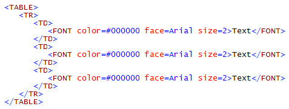
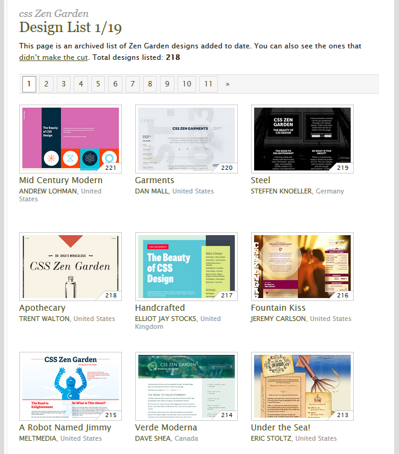

# A Showcase for Separating Content from Form

In a Hurry? Scroll to the end!

## Some History (just to show it's not a new problem)

### The Problem 

*Electronic manuscripts contained control codes or macros for formatting/layout.* In other words: content and layout were all mixed up in the same "machine code", **specific to the process that was being performed and to the system that was performing it. These codes and macros tended to be proprietary, leading to **issues of exchange, and repeated typesetting costs** (e.g. when printers were using different printing presses, or when a press was replaced by a new one from a different manufacturer).

### The Spark: GCA GenCode&reg;

September 1967: a Presentation by William Tunnicliffe from the GCA (Graphic Communications Association) at the Canadian Government Printing Office  on **"The separation of information content of documents from their format"** leads to 
the start of the *generic coding movement* (for example, instead of "format-17" use "heading") and a "Generic Coding" project inside the GCA Composition Committee.

### Help is on the way

Stuff for boring old farts. TL;DR.

#### IBM's GML

In 1969, three guys at IBM conduct a project for integrated law office information systems: Goldfarb, Mosher, and Lowrie. They come up with the *Generalized Markup Language* (**GML**), as a means of allowing text editing, formatting, and information retrieval systems to share documents. GML is based on the generic coding ideas, but rather than a tagging scheme it introduces the concept of a formally-defined **document type** with an explicit nested element structure. 

GML was implemented in mainframe industrial-strength publishing systems. (IBM was the second largest publisher in the world!)

#### ANSI

In 1978, the ANSI committee on Information Processing starts a project on *Computer Languages for the Processing of Text*. They ask *Goldfarb* to lead the project for a *text description language based on GML*. A first working drft is published in 1980. Draft 6 is issued in 1983 and adopted by the US Internal Revenue Service (IRS) and Department of Defense (DoD).

#### ISO

In 1984, ANSI and ISO team up in ISO/IEC JTC1/SC18/WG8. They issue a draft standard for **SGML** - Standard Generalized Mark-up Language - in October 1985. 

In 1986, the first approved version of SGML is published - using a system developed internally at **CERN** -as ISO 8879:1986, .

SGML is the basis for the later HTML (an application of SGML, defining a specific vocabulary), and XML (a subset of SGML conventions as well as an extention).

### The Slippery Slope of the 90s 

* 1990: Tim Berners-Lee (@CERN) specifies a simple HyperText Mark-up Language and writes browser and server software.
* 1991: He issues the first public description of HTML, comprising **18 elements**, strongly inspired on SGMLguid (a CERN Application of SGML). 
* 1995: HTML 2.0 is published as RFC 1866 (Request For Comments). 

The advent of desktop publishing and **WYSIWYG** for the masses (sometimes called *WYSIWY__D__* - What You See Is What You **Deserve** - by those "in the know" -- hands up, those who remember the joys of converting publications between Ventura, PageMaker, Interleaf, DECWrite, ...) also led to a **proliferating practice of creating web pages that used HTML as a formatting language and in doing so - again - mixed content and formatting instructions**. 

This sparked a movement for:

* more semantics (an *SGML for the web*, later to be XML)
* a separate way of coding style and layout (CSS, Cascading Style Sheets)

## 1996: Enter CSS

CSS is designed to **enable the separation of presentation and content**, including layout, colors, and fonts.

This separation can 
* improve content accessibility, 
* provide more flexibility and control in the specification of presentation characteristics, 
* enable multiple web pages to share formatting by specifying the relevant CSS in a separate .css file, and 
* reduce complexity and repetition in the structural content.

Separation of formatting and content also makes it feasible to **present the same markup page in different styles for different rendering methods, such as on-screen, in print, by voice (via speech-based browser or screen reader), and on Braille-based tactile devices**. 

## Illustrating the Idea of Separating Content from Form

http://www.csszengarden.com/

* Identical html
* Different images and CSS
* Resulting in [radically different visuals](http://www.mezzoblue.com/zengarden/alldesigns/)!

## Reading material

* https://en.wikipedia.org/wiki/Cascading_Style_Sheets
* https://en.wikipedia.org/wiki/Separation_of_content_and_presentation

